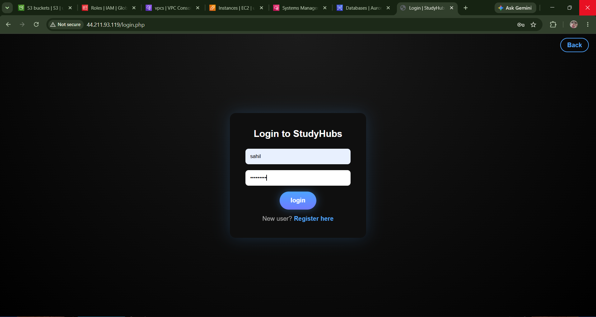
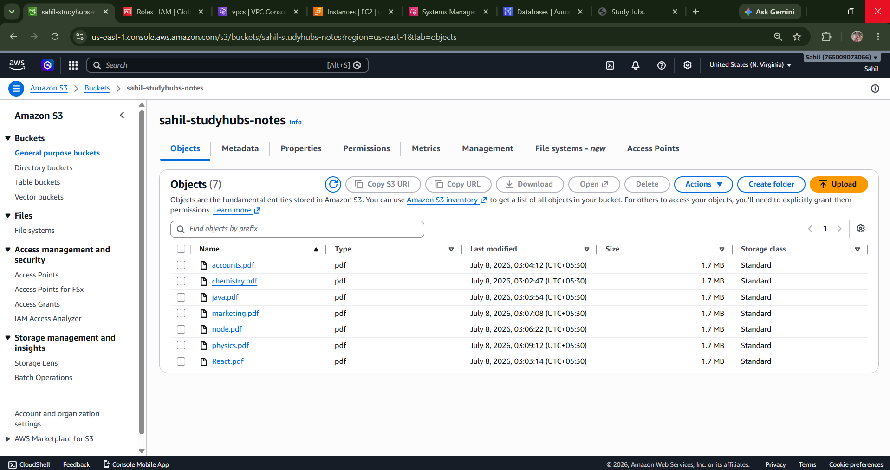
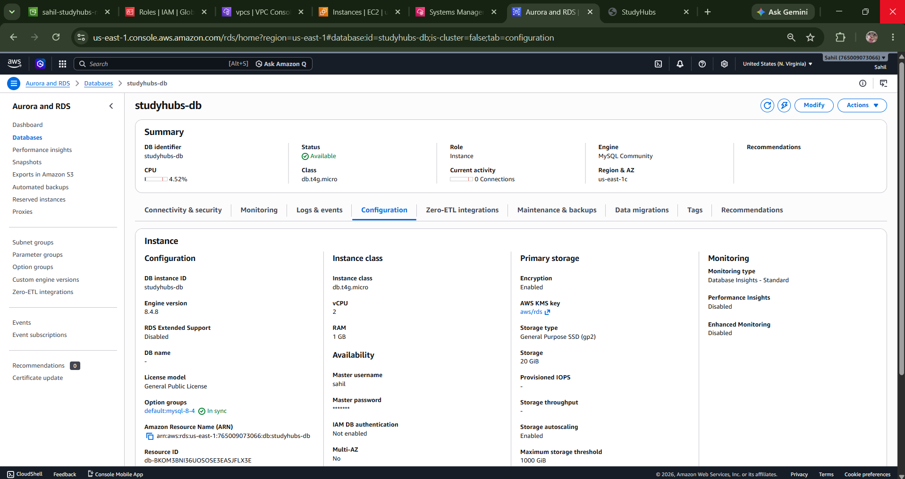
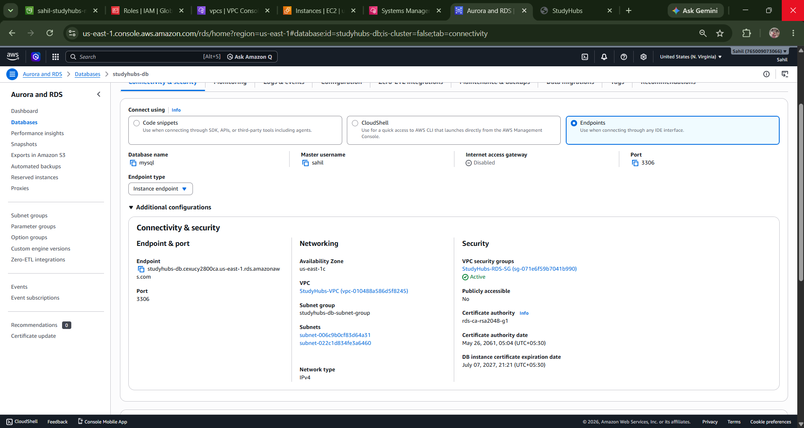
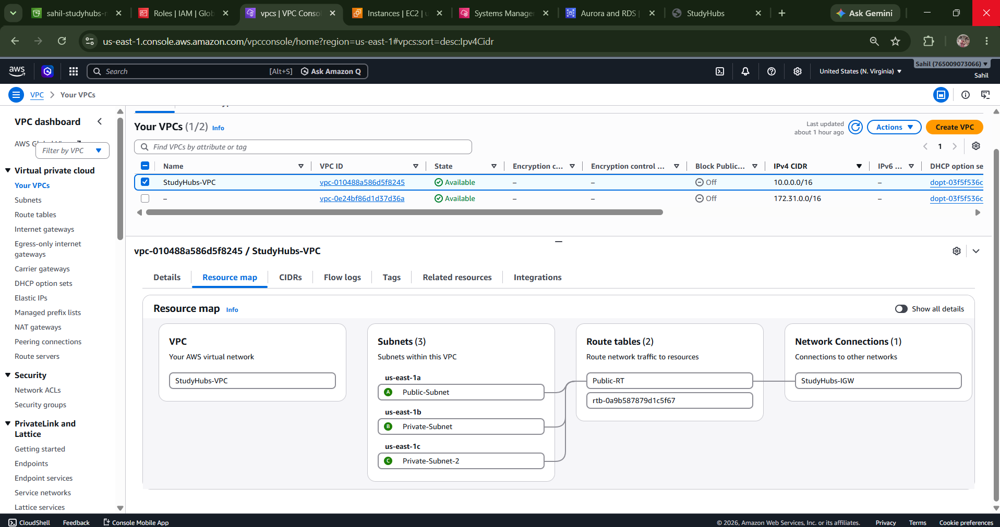
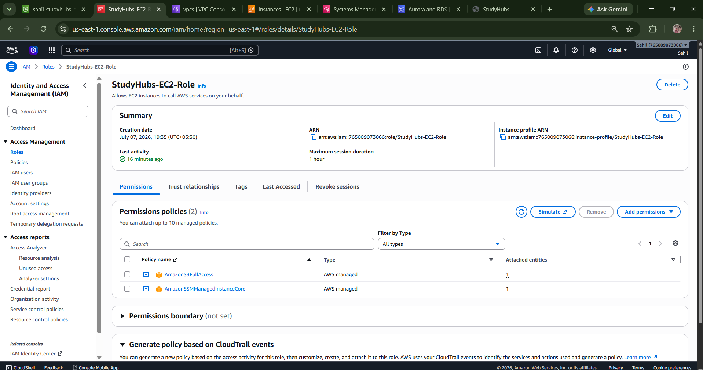

## Quick Info

<h3>StudyHubs:</h3>

A cloud-based notes sharing platform deployed on AWS.

• Backend: PHP 
• Frontend: HTML, CSS, JavaScript 
• Database: Amazon RDS (MySQL) 
• Cloud Storage: Amazon S3 (PDF Files) 
• Hosting: Amazon EC2 
• Authentication: Session-Based Login & IAM Role 
• Networking: Amazon VPC 
• Server Management: AWS Systems Manager (SSM) 
• User Roles: Admin & User 
• Admin Features: Approve, Reject, Delete, Upload and Manage Notes 
• Security: Password Hashing, password_verify(), Session Authentication

## StudyHubs – Cloud-Based Notes Sharing Platform

<h3>Project Overview</h3>

StudyHubs is a cloud-based notes sharing platform deployed on Amazon Web Services (AWS). The application allows students to register, log in securely, upload PDF notes, and access approved study materials. All uploaded notes are reviewed by an administrator before becoming available to other users, ensuring quality and preventing inappropriate content.

The project is built using PHP, MySQL, HTML, CSS and Javascript and deployed on an Amazon EC2 instance. Amazon RDS is used for the database, while Amazon S3 stores all uploaded PDF files. Secure communication between AWS services is achieved using IAM Roles without storing AWS credentials on the server.

## Features
•User Registration 
•Secure Login  
•Session-based Authentication 
•Upload PDF Notes 
•Admin Approval System 
•Admin Dashboard 
•User Dashboard 
•Preview PDF Notes 
•Download PDF Notes 
•Upload Status (Pending / Approved) 
•Category-wise Notes 
•Responsive User Interface 
•Cloud Storage using Amazon S3 
•Cloud Database using Amazon RDS 

## AWS Services Used

| AWS Service | Purpose |
|-------------|---------|
| Amazon EC2 | Hosts the PHP application |
| Amazon RDS (MySQL) | Stores user and notes information |
| Amazon S3 | Stores uploaded PDF files |
| IAM Role | Provides secure access from EC2 to Amazon S3 without storing AWS credentials |
| AWS Systems Manager (SSM) | Securely manages the EC2 instance without using SSH |
| Amazon VPC | Provides network isolation for AWS resources |
 
## Architecture Diagram

## Project Workflow

#### 1. User Registration
• User creates an account. 
• Password is encrypted using password_hash(). 
• User information is stored in Amazon RDS. 

#### 2. Login
• User enters credentials. 
• Password is verified using password_verify(). 
• PHP session is created after successful authentication. 

#### 3. Upload Notes
• User uploads a PDF file. 
• File is stored in Amazon S3. 
• Metadata Metadata (subject, standard, uploader, file name and status) is stored in Amazon RDS. 
• Uploaded note status is initially Pending. 

#### 4. Admin Review
• Administrator views pending notes. 
• Admin can: 
 - View 
 - Approve 
 - Reject 

#### 5. View Notes
• Only approved notes are displayed. 
• Users can preview PDFs directly from Amazon S3. 
• Users can download PDFs securely. 

 

## Database Overview

### userdetails

| Column | Description |
|----------|-------------|
| id | Unique ID |
| username | Username |
| password | Hashed Password |
| role | Admin/User |

### notes

| Column | Description |
|----------|-------------|
| id | Note ID |
| username | Uploaded By |
| subject | Subject |
| standard | Class |
| file_name | PDF Name |
| status | Pending/Approved |
| uploaded_at | Upload Time |

## Screenshots
### Website
#### • Home Page

#### • Login / Register

#### • User Dashboard

#### • Upload notes 

#### • Notes page

#### • Admin dashboard

#### • Review notes

#### • Manages notes

---

### Amazon EC2
#### • EC2 Instance

#### • Session manager

---

### Amazon S3
#### • S3 Bucket

#### • S3 Objects

---

### Amazon RDS
#### • Database Overview

#### • Connectivity & Security

---

### Database Overview
#### • Overview

---

### VPC
#### • Resource Map

---

### IAM Role
#### • IAM Roles / Policies 

 

## AWS Architecture Components

- #### Amazon VPC
    - Public Subnet
    - Internet Gateway
    - Route Table

- #### Amazon EC2
    - Apache
    - PHP
    - Composer

- #### Amazon RDS (MySQL)

- #### Amazon S3
    - PDF Storage

- #### IAM Role
    - EC2 → S3 Access

- #### AWS Systems Manager
    - Server Management

## Technologies Used
- ### Frontend
  - HTML  
  - CSS 
  - Javascript

- ### backend
  - PHP

- ### Database
  - MySQL (Amazon RDS)

- ### Cloud  Services
  - Amazon EC2 
  - Amazon RDS 
  - Amazon S3 
  - AWS IAM 
  - AWS Systems Manager (SSM) 
  - Amazon VPC 

- ### Development Tools
  - Visual Studio Code 
  - Git 
  - GitHub** 
  - Amazon Linux 2023 
  - Apache HTTP Server 
  - Composer 
  - MySQL CLI 

## Security Features
•Password Hashing using password_hash() 
•Password Verification using password_verify() 
•Session-Based Authentication 
•IAM Role (No AWS Access Keys) 
•Amazon RDS Private Database 
•Amazon S3 Bucket Policy 

## Repository Structure
~~~
StudyHubs/
│
├── admin/
├── assets/
│   ├── css/
│   └── image/
├── notes/
├── vendor/
│
├── README.md
├── studyhubs_db.sql
├── composer.json
├── composer.lock
│
├── config.php
├── index.php
├── login.php
├── register.php
├── notes.php
├── upload_note_user.php
└── ...
~~~

## Learning Outcomes

#### Through this project, I gained practical experience with:

Deploying PHP applications on Amazon EC2
Configuring Amazon RDS MySQL
Integrating Amazon S3 for cloud file storage
Managing EC2 securely using Systems Manager (SSM)
Implementing IAM Roles for secure AWS access
Configuring custom VPC networking
Managing Linux servers using Bash commands
Deploying full-stack web applications on AWSz